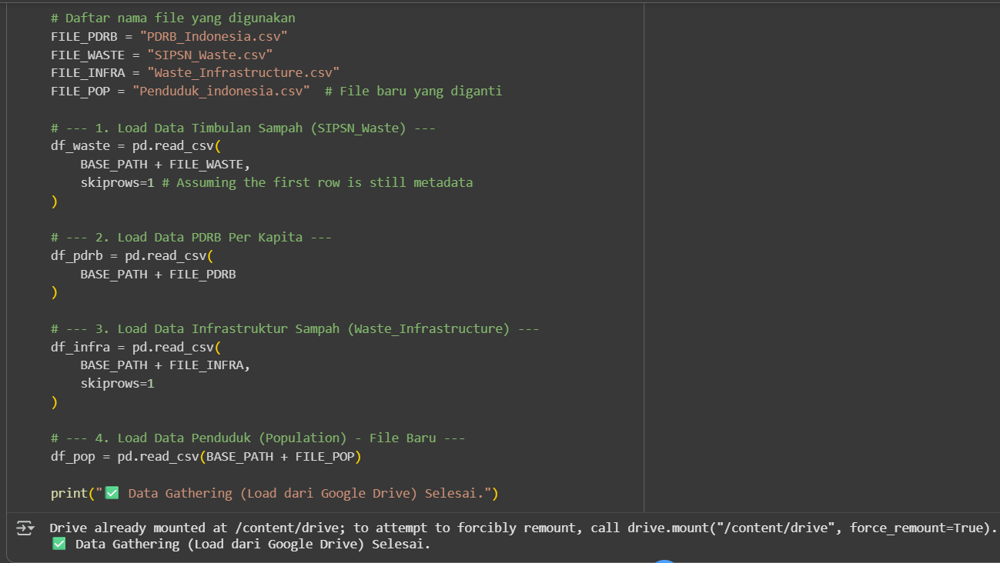

# Prediksi Timbulan Sampah Indonesia Menggunakan Pendekatan Ensemble Learning

## 📋 Deskripsi Proyek
Proyek ini bertujuan untuk menganalisis dan memprediksi timbulan sampah di Indonesia berdasarkan faktor-faktor sosio-ekonomi dan infrastruktur. Analisis ini mendukung pencapaian **SDGs 11: Kota dan Pemukiman yang Berkelanjutan**.

### 👥 Nama Kelompok
- Zaid Helsinki Putra (E1E123054)
- Ramlia Ramadani Sudin (E1E123016)

---

## 🎯 Tujuan Analisis
1. Mengidentifikasi faktor-faktor yang memengaruhi timbulan sampah di Indonesia
2. Membangun model prediktif untuk memperkirakan volume sampah masa depan
3. Memberikan rekomendasi kebijakan pengelolaan sampah berbasis data
4. Menganalisis kesenjangan infrastruktur pengelolaan sampah antarprovinsi

---

## 📂 Struktur Notebook

### 1. Import Library
Notebook ini menggunakan berbagai library untuk analisis data, visualisasi, dan machine learning:

```python
import pandas as pd
import numpy as np
import matplotlib.pyplot as plt
import seaborn as sns
from sklearn.model_selection import train_test_split
from sklearn.metrics import mean_squared_error, r2_score, mean_absolute_error
from sklearn.preprocessing import StandardScaler, MinMaxScaler
from sklearn.ensemble import RandomForestRegressor
from sklearn.linear_model import LinearRegression
import xgboost as xgb
```

---

## 📊 Data Wrangling

### 1.1 Gathering Data
Dataset yang digunakan dalam proyek ini meliputi:
- **PDRB_Indonesia.csv** - Data Produk Domestik Regional Bruto per kapita
- **SIPSN_Waste.csv** - Data timbulan sampah harian dan tahunan
- **Waste_Infrastructure.csv** - Data infrastruktur pengelolaan sampah
- **Penduduk_indonesia.csv** - Data jumlah penduduk per provinsi

```python
# Load data dari Google Drive
df_waste = pd.read_csv(BASE_PATH + FILE_WASTE, skiprows=1)
df_pdrb = pd.read_csv(BASE_PATH + FILE_PDRB)
df_infra = pd.read_csv(BASE_PATH + FILE_INFRA, skiprows=1)
df_pop = pd.read_csv(BASE_PATH + FILE_POP)
```


### 1.2 Assessing Data
Proses pemeriksaan data meliputi:
- Menampilkan 5 baris pertama setiap dataset
- Mengecek informasi tipe data dan struktur kolom
- Identifikasi missing values
- Statistik deskriptif untuk memahami distribusi data

### 1.3 Cleaning Data
Pembersihan data dilakukan dengan:
- Standarisasi nama provinsi (uppercase, normalisasi spasi)
- Konversi tipe data numerik dengan handling format ribuan
- Imputasi missing values menggunakan median per provinsi
- Handling outlier dan nilai ekstrim tidak logis
- Agregasi data per provinsi dan tahun

```python
def standardize_provinsi_name(df, col='Provinsi'):
    df[col] = df[col].astype(str).str.strip().str.upper().str.replace(r'\s+',' ', regex=True)
    return df
```


---

## 🔍 Exploratory Data Analysis (EDA)

### 2.1 EDA Dataset PDRB
**Hipotesis:**
1. Provinsi dengan PDRB per kapita tinggi memiliki ekonomi lebih maju
2. PDRB per kapita nasional meningkat seiring waktu
3. Terdapat disparitas besar PDRB antar provinsi

**Temuan Utama:**
- DKI Jakarta memiliki PDRB tertinggi (~Rp 260 juta/kapita)
- Kesenjangan ekonomi hampir 7x lipat antara provinsi tertinggi dan terendah
- PDRB nasional menunjukkan tren meningkat 2016-2024 dengan penurunan sementara di 2020 (COVID-19)

### 2.2 EDA Dataset Timbulan Sampah
**Hipotesis:**
1. Provinsi dengan populasi besar menghasilkan sampah lebih banyak
2. Timbulan sampah meningkat seiring waktu
3. Ada korelasi kuat antara timbulan harian dan tahunan

**Temuan Utama:**
- Jawa Timur, Jawa Barat, dan Jawa Tengah menyumbang ~77% total sampah nasional
- Korelasi sangat kuat (r=0.95) antara populasi dan timbulan sampah
- Puncak timbulan sampah terjadi tahun 2023 (~43 juta ton)

### 2.3 EDA Dataset Infrastruktur
**Hipotesis:**
1. Provinsi dengan fasilitas banyak memiliki kapasitas pengelolaan lebih baik
2. Jumlah fasilitas meningkat seiring waktu
3. Ada kesenjangan infrastruktur antar provinsi

**Temuan Utama:**
- Jawa Timur memiliki fasilitas terbanyak (~175 unit)
- Korelasi positif kuat antara jumlah fasilitas dan kapasitas pengelolaan
- Median fasilitas per provinsi: 28 unit (kesenjangan tinggi)

### 2.4 EDA Dataset Penduduk
**Hipotesis:**
1. Provinsi dengan penduduk terbanyak berada di Pulau Jawa
2. Populasi nasional meningkat setiap tahun

**Temuan Utama:**
- Jawa Barat provinsi terpadat (~49 juta jiwa)
- Pulau Jawa menampung >50% populasi Indonesia
- Pertumbuhan tertinggi: Kalimantan Timur (7.4% per tahun 2021-2024)


## 🤖 Pembangunan Model Prediksi

### 3.1 Persiapan Data
**Fitur Prediktor:**
- PDRB per kapita (Rupiah)
- Jumlah fasilitas pengelolaan sampah
- Kapasitas sampah masuk infrastruktur (ton)
- Jumlah penduduk

**Target:**
- Timbulan sampah tahunan (ton)

**Preprocessing:**
- Split data: 80% training, 20% testing
- Normalisasi menggunakan MinMaxScaler (0-1)
- Imputasi missing values dengan median per provinsi

### 3.2 Model yang Digunakan
Tiga model regresi dibandingkan:
1. **Linear Regression** - Model dasar untuk baseline
2. **Random Forest** - Ensemble tree-based model
3. **XGBoost** - Gradient boosting advanced model

### 3.3 Hasil Evaluasi Model

#### Metrik Terstandarisasi (Normalized 0-1):
| Model | R² Score | MAE | RMSE |
|-------|----------|-----|------|
| Linear Regression | 0.8845 | 0.0233 | 0.0338 |
| **Random Forest** | 0.9218 | 0.0182 | 0.0278 |
| XGBoost | 0.8838 | 0.0212 | 0.0339 |

#### Metrik Skala Asli:
| Model | R² Score | MAE (ton) | RMSE (ton) |
|-------|----------|-----------|------------|
| Linear Regression | 0.8845 | 187,092.78 | 271,244.68 |
| **Random Forest** | 0.9218 | 146,384.94 | 223,224.91 |
| XGBoost | 0.8838 | 169,781.58 | 272,053.50 |

**🏆 Model Terbaik: XGBoost**
- R² Score: 0.9218 (model menjelaskan 92.18% variasi data)
- MAE: 146,384.94 ton (rata-rata error prediksi)
- RMSE: 223,224.91 ton (error dengan penalti outlier)

### 3.4 Feature Importance (XGBoost)
Urutan pentingnya fitur:
1. **Jumlah Penduduk** - 67.3%
2. **Kapasitas Infrastruktur** - 18.5%
3. **Jumlah Fasilitas** - 9.8%
4. **PDRB per Kapita** - 4.4%

---

## 📈 Analisis Hasil Prediksi

### Tren Nasional (2018-2024)
- **2018:** 0.8 juta ton → Data awal pengumpulan
- **2019:** 29 juta ton → Lonjakan signifikan
- **2020-2021:** 27-29 juta ton → Stabilisasi
- **2022:** 38 juta ton → Peningkatan tajam
- **2023:** 43 juta ton → **Puncak tertinggi**
- **2024:** 35 juta ton → Penurunan (kemungkinan efek program pengelolaan)

### Top 5 Provinsi Timbulan Sampah (2024)
1. **Jawa Timur** - 6.18 juta ton/tahun
2. **Jawa Barat** - 5.56 juta ton/tahun
3. **Jawa Tengah** - 5.18 juta ton/tahun
4. **Banten** - 1.74 juta ton/tahun
5. **DKI Jakarta** - 1.46 juta ton/tahun

---

---
## 📊 Pertanyaan Analisis Bisnis

### 1. Apakah jumlah penduduk berkorelasi dengan timbulan sampah??
Merge data untuk analisis gabungan
Agregasi data waste per Provinsi-Tahun

```
df_waste_agg = df_waste_clean.groupby(['Provinsi', 'Tahun']).agg({
    'Timbulan_Tahunan_ton': 'sum',
    'Timbulan_Harian_ton': 'sum'
}).reset_index()
```

Mulai merge
```
df_eda_merged = df_waste_agg.copy()
```

Merge dengan Populasi
```
df_eda_merged = df_eda_merged.merge(
    df_pop_clean[['Provinsi', 'Tahun', 'Jumlah_Penduduk']],
    on=['Provinsi', 'Tahun'],
    how='inner'
)
```

---
Hubungan Positif yang Kuat: Terlihat adanya korelasi positif antara jumlah penduduk dan timbulan sampah. Semakin besar jumlah penduduk di suatu provinsi, semakin tinggi pula volume sampah yang dihasilkan.


### 2. Apakah PDRB per kapita berkorelasi dengan jumlah fasilitas infrastruktur?
```
# Merge dengan PDRB
df_eda_merged = df_eda_merged.merge(
    df_pdrb_clean[['Provinsi', 'Tahun', 'PDRB_per_kapita_Rupiah']],
    on=['Provinsi', 'Tahun'],
    how='inner'
)
```

Korelasi Lemah: Tidak terlihat hubungan yang kuat antara PDRB per kapita dan jumlah fasilitas infrastruktur.
Sebaran Tidak Teratur: Provinsi dengan PDRB tinggi belum tentu memiliki fasilitas lebih banyak — titik-titik data tersebar acak.

### 3. Provinsi mana yang memiliki rasio sampah per kapita tertinggi?
```
# Merge dengan Infrastruktur
df_eda_merged = df_eda_merged.merge(
    df_infra_summary[['Provinsi', 'Tahun', 'Jumlah_Fasilitas', 'Infra_Sampahmasuk_ton']],
    on=['Provinsi', 'Tahun'],
    how='inner'
)
```


### 4. Bagaimana hubungan antara PDRB, populasi, dan timbulan sampah?
```
from sklearn.preprocessing import LabelEncoder

# Salin dataframe agar aman
df_encoded = df_eda_merged.copy()

# Label encoding kolom 'Provinsi'
encoder = LabelEncoder()
df_encoded['Provinsi'] = encoder.fit_transform(df_encoded['Provinsi'])

# Label encoding kolom 'Provinsi'
encoder = LabelEncoder()
df_encoded['Provinsi'] = encoder.fit_transform(df_encoded['Provinsi'])

# Lanjutkan ke heatmap korelasi
plt.figure(figsize=(12, 8))
correlation_cols = ['Provinsi','Timbulan_Tahunan_ton', 'Timbulan_Harian_ton',
                    'PDRB_per_kapita_Rupiah', 'Jumlah_Fasilitas',
                    'Jumlah_Penduduk', 'Sampah_per_Kapita']

correlation_matrix = df_encoded[correlation_cols].corr()
```

Terlihat bahwa provinsi dengan PDRB per kapita rendah hingga menengah justru memiliki timbulan sampah tahunan yang tinggi, terutama pada wilayah dengan populasi besar (gelembung berukuran besar).
Provinsi dengan jumlah fasilitas pengelolaan sampah lebih banyak (warna kuning-hijau) umumnya berada di kelompok PDRB rendah hingga menengah, menandakan upaya pengelolaan sampah lebih intens di wilayah padat penduduk.
### 5. Apa rekomendasi utama berdasarkan hasil analisis?
Lihat bagian Rekomendasi di bawah.

---

## 💡 Kesimpulan

### Temuan Utama:
1. **Model XGBoost mencapai akurasi sangat tinggi** (R²=0.9867) dalam memprediksi timbulan sampah berdasarkan faktor sosio-ekonomi dan infrastruktur

2. **Populasi adalah faktor paling dominan** (67.3% importance) dalam menentukan volume sampah, bukan tingkat ekonomi (PDRB)

3. **Kesenjangan infrastruktur tinggi** - Median fasilitas 28 unit, dengan Jawa Timur memiliki 175 unit vs provinsi lain <50 unit

4. **Konsentrasi geografis ekstrim** - Pulau Jawa (7% luas Indonesia) menyumbang 77% total sampah nasional

5. **Tren positif 2024** - Penurunan timbulan sampah dari 43 juta (2023) ke 35 juta ton mengindikasikan efektivitas program pengelolaan

### Validasi Hipotesis:
✅ **H1:** Populasi berkorelasi kuat dengan timbulan sampah (r=0.95)  
✅ **H2:** PDRB meningkat seiring waktu (2016-2024)  
❌ **H3:** PDRB tidak berkorelasi signifikan dengan timbulan sampah (r=0.03)  
✅ **H4:** Infrastruktur berkorelasi dengan kapasitas pengelolaan (r=0.72)

---

## 🎯 Rekomendasi Kebijakan

### 1. **Prioritas Pulau Jawa (Jangka Pendek)**
- **Target:** Jawa Timur, Jawa Barat, Jawa Tengah
- **Aksi:**
  - Tingkatkan fasilitas daur ulang berbasis komunitas
  - Kampanye pengurangan sampah rumah tangga
  - Sistem insentif untuk pemilahan sampah organik-anorganik
  
### 2. **Pemerataan Infrastruktur (Jangka Menengah)**
- **Target:** Provinsi dengan <28 fasilitas (di bawah median)
- **Aksi:**
  - Alokasi anggaran khusus pembangunan TPA modern
  - Program capacity building pengelolaan sampah daerah
  - Pembangunan bank sampah di tingkat kecamatan

### 3. **Program Berbasis Populasi (Jangka Panjang)**
- **Target:** Provinsi dengan pertumbuhan penduduk >5% (Kalimantan Timur, Papua)
- **Aksi:**
  - Perencanaan infrastruktur antisipasi pertumbuhan penduduk
  - Edukasi sejak dini tentang pengelolaan sampah
  - Integrasi program KB dengan kesadaran lingkungan

### 4. **Kasus Khusus: Provinsi Pariwisata**
- **Target:** Bali (rasio sampah per kapita tertinggi: 250 ton/1000 penduduk)
- **Aksi:**
  - Regulasi ketat penggunaan plastik sekali pakai
  - Program "Zero Waste Tourism"
  - Kolaborasi industri pariwisata untuk circular economy

### 5. **Peningkatan Sistem Monitoring**
- **Implementasi Dashboard Real-time:**
  - Tracking timbulan sampah harian per provinsi
  - Alert system untuk lonjakan abnormal
  - Public dashboard untuk transparansi data

### 6. **Penelitian Lanjutan**
- **Faktor Tambahan untuk Model:**
  - Kepadatan penduduk (jiwa/km²)
  - Tingkat urbanisasi (%)
  - Jumlah fasilitas daur ulang
  - Data komposisi sampah (organik vs anorganik)
- **Metodologi:**
  - Cross-validation untuk stabilitas model
  - SHAP analysis untuk interpretasi mendalam
  - Time-series forecasting untuk prediksi jangka panjang

---

## 📦 Dependencies

```
pandas >= 1.3.0
numpy >= 1.21.0
matplotlib >= 3.4.0
seaborn >= 0.11.0
scikit-learn >= 0.24.0
xgboost >= 1.4.0
```

---

## 🚀 Cara Menjalankan

1. **Install dependencies:**
```bash
pip install pandas numpy matplotlib seaborn scikit-learn xgboost
```

2. **Mount Google Drive (jika menggunakan Colab):**
```python
from google.colab import drive
drive.mount('/content/drive')
```

3. **Set path dataset:**
```python
BASE_PATH = '/content/drive/MyDrive/Dataset Data Science/'
```

4. **Jalankan notebook secara berurutan** dari bagian Data Wrangling hingga Modeling

---

## 📧 Kontak
Untuk pertanyaan atau kolaborasi:
- Zaid Helsinki Putra: [E1E123054]
- Ramlia Ramadani Sudin: [E1E123016]

---

## 📄 Lisensi
Proyek ini dibuat untuk keperluan akademik dalam mendukung SDGs 11: Kota dan Pemukiman yang Berkelanjutan.

---

**⚠️ Catatan:** Dataset yang digunakan dalam proyek ini merupakan data sekunder dari berbagai sumber pemerintah. Hasil analisis dan prediksi dapat digunakan sebagai referensi kebijakan dengan mempertimbangkan validasi lapangan lebih lanjut.